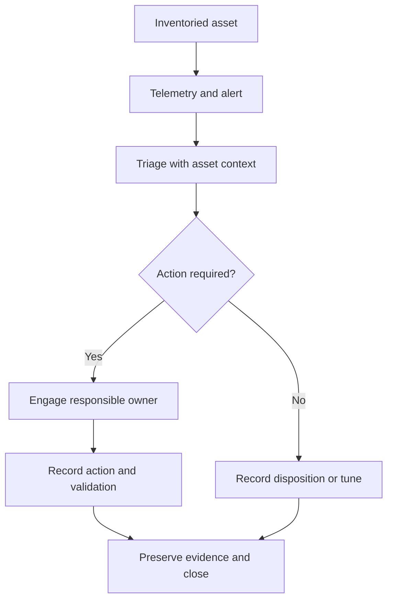

# Internal SOC Implementation — Security Monitoring & Operations

[← All 13 technical cases](../../README.md)

**Author:** Samuel Guigo  
**Role:** Infrastructure & Security — hands-on implementation with my team  
**Project:** Implementation of an internal Security Operations Center  
**Status:** Implementation in progress

## Project overview

My team and I are implementing a SOC inside the company. The project combines asset context, infrastructure monitoring, security telemetry and an operational process for alert classification, investigation and response.

I work on the technical implementation and the operating model as part of this team delivery. Architecture, configuration, controlled testing, integration and rollout are workstreams within the same project.

The current objective is to establish the initial operational capability and expand it through validated use cases. Controlled validation supports the implementation; the overall project is an internal SOC deployment.

## My role and team responsibilities

My work covers the monitoring and security infrastructure, configuration of telemetry and policies, technical validation and documentation. Together, we are developing the service around the following responsibilities:

- Establish the monitored scope and asset context.
- Implement and integrate the monitoring components.
- Configure endpoint telemetry and centralized policies.
- Validate event generation and collection.
- Define alert classification, triage and escalation.
- Document technical findings, actions and follow-up.
- Prepare protection and recovery of the monitoring infrastructure.
- Expand coverage as the implementation progresses.

## Technology workstreams

| Component | Role in the SOC implementation | Workstream |
|---|---|---|
| NetBox | Asset inventory and infrastructure context | Associate monitored assets with their operational context |
| Zabbix | Availability, performance and capacity | Implement infrastructure visibility and operational alerts |
| Wazuh | Endpoint logs, FIM, inventory and vulnerability telemetry | Configure collection, policies and security use cases |
| Virtualization | Hosting and infrastructure events | Integrate the underlying platform with service operation |
| Backup | Protection of critical services and configuration | Establish backup and recovery procedures |
| Grafana | Consolidated visualization where useful | Develop views for operational and management needs |

The table describes the implementation scope. Each component has its own configuration and validation milestones.

## Concrete implementation progress

The Wazuh and Zabbix implementation and the SOC operating model belong to this same project. The following technical validation is one milestone of the deployment.

## Technical scope and maturity

| Component | Work represented | Recorded stage |
|---|---|---|
| Wazuh Windows agent | Endpoint telemetry and agent organization | Implementation work |
| Central Windows-group policy | Apply the monitoring policy centrally | Validated for the FIM scenario |
| File Integrity Monitoring | Create, modify and delete a test file | Events observed |
| Syscollector | Hardware/software inventory exploration | Implementation scope |
| Vulnerability Detection | Vulnerability-related telemetry exploration | Implementation scope |
| Sysmon | Integration study | Initial study |
| Zabbix | Availability and capacity monitoring | Infrastructure-monitoring scope |

## FIM test I carried out

### Prepare the controlled test

I used a dedicated test file and the Windows-group monitoring policy. The test was intended to produce recognizable events without involving production documents.

### Generate distinct changes

I exercised three file lifecycle actions:

1. Create the test file.
2. Modify the file.
3. Delete the file.

Each action had a corresponding event to look for, making it possible to validate more than agent connectivity alone.

### Check the received events

The recorded FIM result included **added**, **modified** and **deleted** events.

This demonstrated that the centralized policy worked for the tested Windows scenario and that the monitored changes reached the event view.

## What the result established

| Result | Interpretation |
|---|---|
| File creation event received | The tested addition was detected |
| File modification event received | The tested change was detected |
| File deletion event received | The tested removal was detected |
| Policy applied through the Windows group | Central configuration worked for this scope |

The test validated a specific collection path. Coverage of all endpoints, retention quality and incident-response effectiveness require their own tests.

## Operating process being implemented

The SOC connects telemetry to a decision and an owner. The process being established follows this flow:

Implementation includes both the technical collection and the documentation needed to follow that process consistently.

## Use cases in the implementation scope

| Use case | Investigation purpose |
|---|---|
| Agent or host communication loss | Determine whether the endpoint or collection path failed |
| Critical disk usage | Assess service impact and capacity action |
| File-integrity changes | Determine whether a change was expected |
| Abnormal authentication | Review context and escalate when required |
| Applicable vulnerabilities | Associate findings with assets and treatment decisions |
| Backup failure | Assess failed protection tasks and recovery implications |
| Virtualization events | Assess platform impact on services |

## Implementation stages

### Configure and integrate

Establish the platform, asset scope, agent organization and collection policies. Track integration progress for each component rather than assume that installing the stack completes the service.

### Validate telemetry and detections

Generate controlled events, verify collection and review the resulting alerts. The Windows FIM test is a recorded example of this stage.

### Establish triage and escalation

Define severity, ownership and investigation records. Exercise the path from an alert to a documented action or disposition.

### Prepare operational continuity

Monitor the SOC infrastructure itself and validate backup and recovery. Record dependencies and runbooks for maintaining the service.

### Expand the rollout

Add assets and use cases as configurations and procedures are validated. Tune detections and address collection gaps as the deployment grows.

## Status and delivery outcome

**In progress:** internal SOC implementation by my team and me, spanning the platform, telemetry, integrations and operating procedures.

**Validated milestone:** centralized Windows FIM policy with creation, modification and deletion events received.

**Next milestones:** broader collection and coverage, use-case validation, alert tuning, triage/escalation procedures and operational handover.

The project is building the company's security-monitoring capability. Its ongoing status describes implementation progress; final coverage and service acceptance are tracked as delivery milestones.

## Skills demonstrated

SOC implementation · Security monitoring · Wazuh · Zabbix · NetBox · Infrastructure integration · Centralized policies · FIM · Telemetry validation · Triage workflows · Technical documentation · Team delivery

## Confidentiality

Internal asset names, addresses, credentials and identifying implementation details are omitted. See the [publication policy](../../SECURITY.md).
