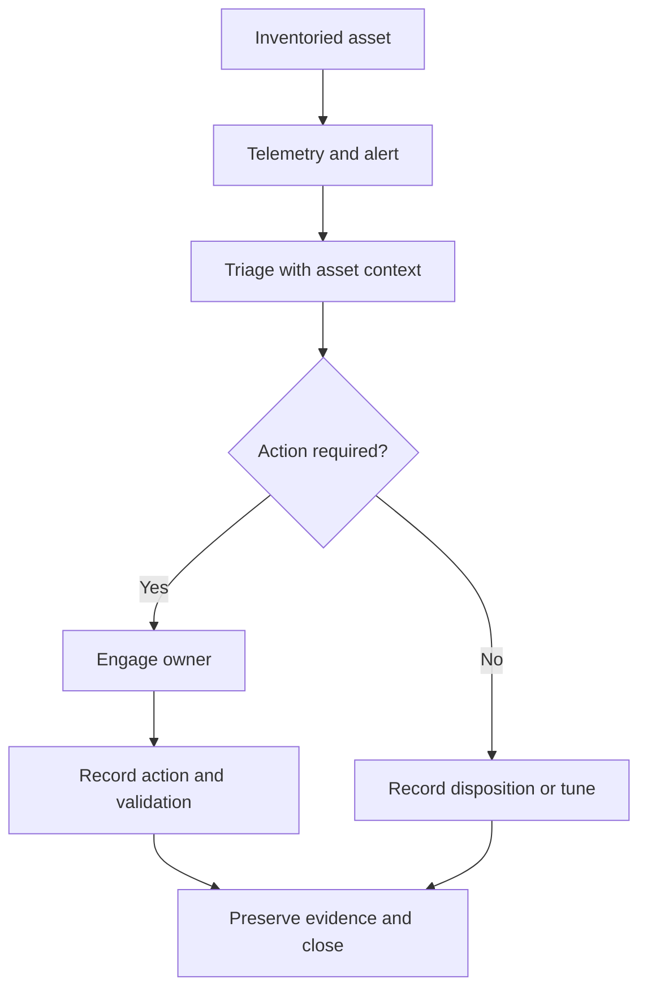

# SOC MVP — Security Monitoring Architecture & Implementation Roadmap

[← All 15 technical cases](../../README.md)

**Author:** Samuel Guigo  
**Role:** Infrastructure & Security Architecture  
**Delivery:** Architecture, operating model and phased execution plan

## Architecture summary

I designed an internal Security Operations Center MVP around asset context, infrastructure monitoring, endpoint telemetry and a repeatable investigation process.

My deliverable was the architecture and execution plan: component responsibilities, initial use cases, a triage workflow and criteria for expanding the scope. The design was intended for a small set of authorized internal assets.

## Problem addressed

Collecting logs and installing agents does not establish who owns an alert, how it is investigated or how the supporting infrastructure is recovered.

I designed the MVP around those operational relationships so the technology stack would support a defined process.

## Component responsibilities

| Component | Assigned responsibility | Operational use |
|---|---|---|
| NetBox | Asset inventory and infrastructure context | Associate observations with managed assets |
| Zabbix | Availability, performance and capacity | Identify infrastructure and service degradation |
| Wazuh | Endpoint logs, FIM, inventory and vulnerability telemetry | Supply security investigation evidence |
| Virtualization platform | Host the components and provide infrastructure events | Establish platform dependencies |
| Backup platform | Protect critical configuration and services | Support recovery |
| Grafana | Optional consolidated visualization | Present useful operational or executive views |

These are roles in the proposed architecture, not a declaration that every integration was already deployed.

## Operating workflow

I defined a repeatable sequence from an inventoried asset to a documented resolution:

The workflow gives the MVP an operational purpose: an alert leads to a decision with an owner and an evidence trail.

## Initial use cases I designed

| Use case | Investigation focus |
|---|---|
| Agent or host communication loss | Distinguish endpoint state from collection-path failure |
| Critical disk usage | Determine service impact and capacity action |
| File-integrity change | Review the event and whether the change was expected |
| Abnormal authentication | Examine context and escalate when warranted |
| Applicable vulnerability | Relate the finding to asset ownership and treatment |
| Backup failure | Check the failed job and recovery implications |
| Virtualization event | Assess platform impact on monitored services |

## Phased implementation plan

### Establish scope and context

Start with a limited set of authorized assets, inventory them and record the ownership required for triage.

### Validate collection

Confirm that each selected component produces usable telemetry. Controlled test events should demonstrate the path from source to alert.

### Exercise triage

Classify the test event, document the investigation and record the action or risk decision. Tune noisy or unhelpful detections before expanding coverage.

### Protect the monitoring platform

Monitor the monitoring components themselves and validate backup/recovery procedures. A blind or unrecoverable monitoring platform would undermine the operating model.

### Expand after evidence review

Add assets and use cases after the initial workflow is repeatable. The MVP intentionally excludes disruptive automatic response.

## Deliverables and status

I produced the component model, scoped use cases, triage process and phased execution requirements.

The architecture remains an MVP design and implementation plan. It does not imply staffed 24×7 operations, an approved service-level agreement or full production coverage.

Related validation: [Wazuh Windows FIM laboratory](../wazuh-zabbix-security-monitoring-lab/README.md).

## Skills demonstrated

Security architecture · SOC operating model · Asset context · Wazuh · Zabbix · NetBox · Triage design · Recovery planning · Implementation roadmaps

## Confidentiality

Customer names, internal addresses, hostnames, credentials and identifying infrastructure details are omitted. See the [publication policy](../../SECURITY.md).
